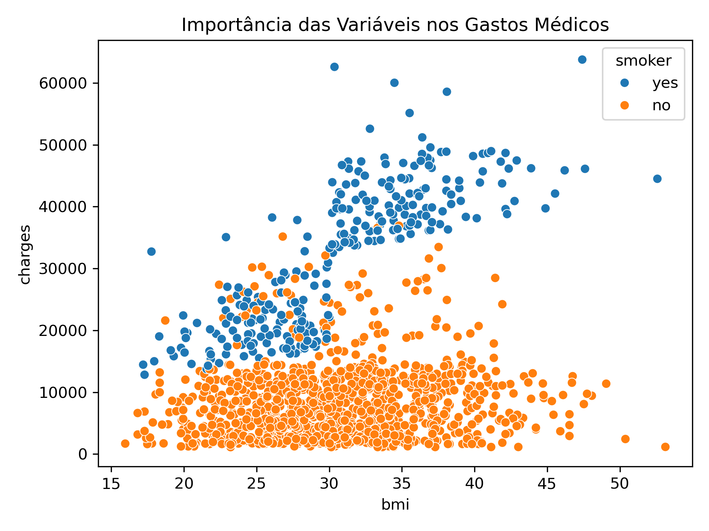
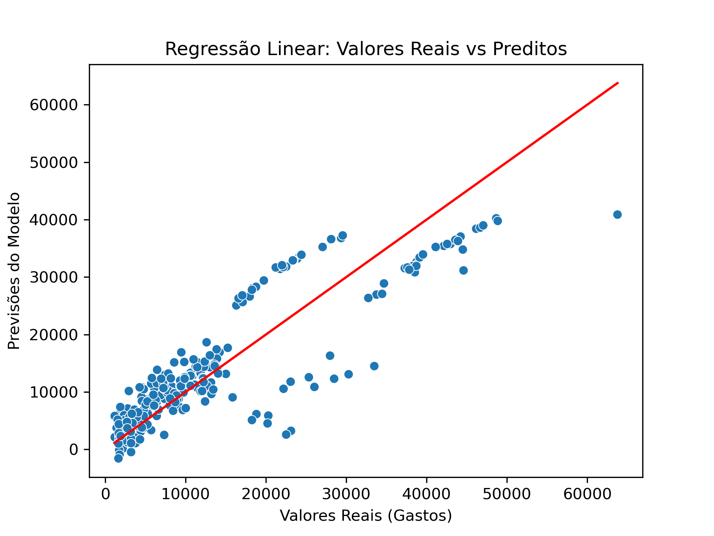
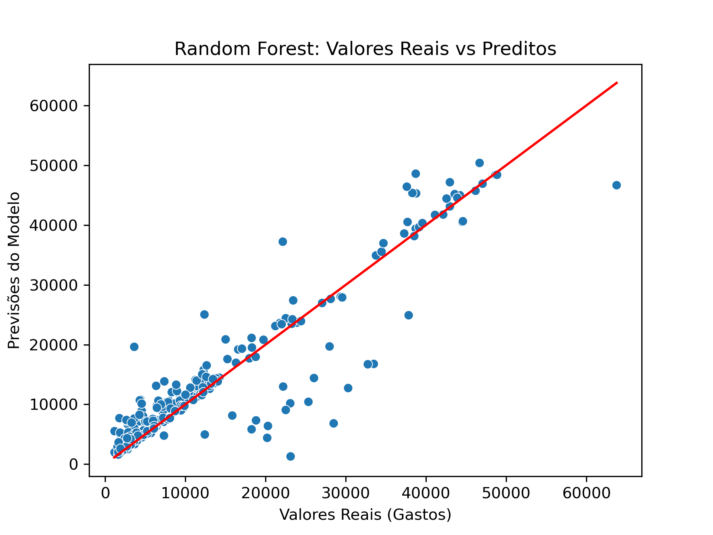

# Predição de Gastos Médicos Individuais


Este projeto aplica técnicas de Machine Learning para prever o custo de faturas médicas individuais com base em características demográficas e hábitos de saúde. O objetivo é identificar os principais fatores que elevam os custos clínicos e comparar a eficácia de modelos lineares e baseados em árvores de decisão.

## Objetivo do Projeto
Desenvolver um modelo preditivo capaz de estimar despesas médicas, auxiliando na gestão financeira de clínicas ou na provisão de recursos para operadoras de saúde. O foco está na interpretabilidade dos dados para entender como o estilo de vida impacta diretamente no faturamento clínico.

## 📂 Fonte dos Dados
Os dados foram obtidos no **Kaggle**:
* **Dataset:** [Medical Cost Personal Datasets](https://www.kaggle.com/datasets/mirichoi0218/insurance)
* **Descrição:** Dados simulados que incluem idade, sexo, IMC, número de filhos, hábito de fumar e região.

## Tecnologias Utilizadas
* **Linguagem:** Python 3.11
* **Manipulação de Dados:** Pandas & NumPy
* **Visualização:** Seaborn & Matplotlib
* **Machine Learning:** Scikit-Learn (LinearRegression, RandomForestRegressor)
* **Gestão de Ambiente:** Conda

## Principais Insights
* **Tabagismo (Smoker):** É o fator isolado com maior impacto, sendo responsável pela maior parte da variabilidade nos preços.
* **Interação IMC x Fumo:** O modelo identificou que o IMC elevado (BMI > 30) potencializa drasticamente os gastos em pacientes fumantes.
* **Fatores Demográficos:** Variáveis como sexo e região apresentaram baixa relevância estatística na composição dos gastos médicos neste dataset.

## Performance dos Modelos
Foram testados dois algoritmos principais para comparação de desempenho:

| Modelo | R² Score | Descrição |
| :--- | :--- | :--- |
| **Regressão Linear** | 0.78 | Modelo base (baseline). Eficiente para tendências gerais, mas limitado em relações não-lineares. |
| **Random Forest** | **0.86** | **Modelo vencedor.** Capturou com precisão os "saltos" de custo causados pelos fatores de risco. |

## Visualização dos Resultados

### Importância das Variáveis
Este gráfico demonstra que o tabagismo e o IMC são os fatores que mais impactam os gastos médicos.


### Precisão do Modelo (Regressão Linear)
O modelo inicial apresentou uma boa tendência, mas nota-se uma dispersão maior nos valores elevados, onde a linearidade não é perfeita.


### Precisão do Modelo (Random Forest)
O alinhamento dos pontos com a linha de referência confirma a alta precisão do modelo.


## Como Replicar o Projeto

Este repositório inclui um arquivo `environment.yml` para garantir que as versões das bibliotecas sejam idênticas às utilizadas no desenvolvimento.

1. **Clone o repositório:**
   ```bash
   git clone https://github.com/Gabriel-Domingueti/medical-cost-prediction.git
   cd medical-cost-prediction

2. **Crie e ative o ambiente Conda:**
    ```bash
    conda env create -f environment.yml
    conda activate medical-analysis-env

3. **Inicie o Jupyter Notebook ou abra no VScode:**
    ```bash
    jupyter notebook analise.ipynb